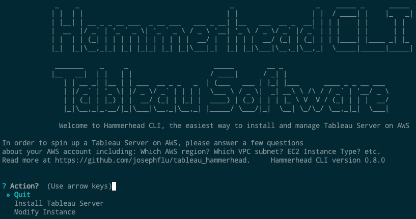
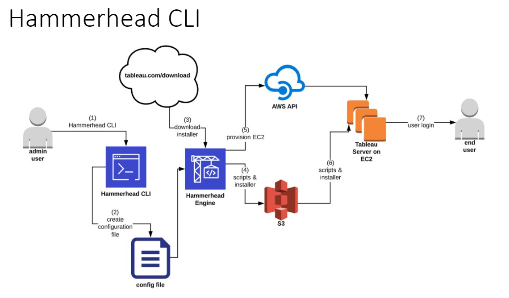

# Tableau Hammerhead CLI
  
**The easiest way to Install Tableau Server on AWS**


What does Hammerhead CLI do?
- Spin up AWS EC2 instances
- Download and run the Tableau Server installer on these instances and configure the cluster
  
---
### Prerequisites for Hammerhead CLI
- Install Python 3.7
- Install python modules by executing this script from the directory ./setup_python 
``` pip install -r requirements.txt```

### Run Hammerhead CLI
- Clone this repo ``` git clone https://github.com/josephflu/tableau_hammerhead```
- Make sure you have local AWS CLI credentials stored at ```~/.aws/credentials``` on linux and ```c:\users\{username}\.aws\credentials``` on windows \
[aws cli credentials documentation](https://docs.aws.amazon.com/cli/latest/userguide/cli-configure-files.html)
- Run Hammerhead CLI\
``` python -m src.cli.start ```
or just\
```./run```
  
### Release Notes
[Release Notes](release_notes.md)

---
### FAQ
How long does it take to run?
- 18 minutes for single node cluster or about one hour for 3 node cluster

What operating systems are supported?
- AmazonWindows2019
- AmazonLinux2
  
What features are supported?
- Install Tableau Server
- Report Instances created by Hammerhead CLI
- Modify Instance (Start, Stop, Reboot, Terminate, Get Password)

What future features are planned?
- Upgrade Tableau Server
- Install Tableau Prep Builder

Target Cloud Platforms
- Only AWS is currently supported
- Azure and GCP have been requested but development has not yet started
- Docker support is being prototyped

---
### Images
  
Screenshot\


Workflow\

  
  
  
---
## Contributors
Joseph Fluckiger\
Gustavo Armenta\
Kevin Glover\
Takashi Binns\
Vijeth Shetty\
Testing and feature input: Jeffrey Lehmann, Charlee McGee, Peter Han, Jim Schneidereit, and many more. Thank you!
